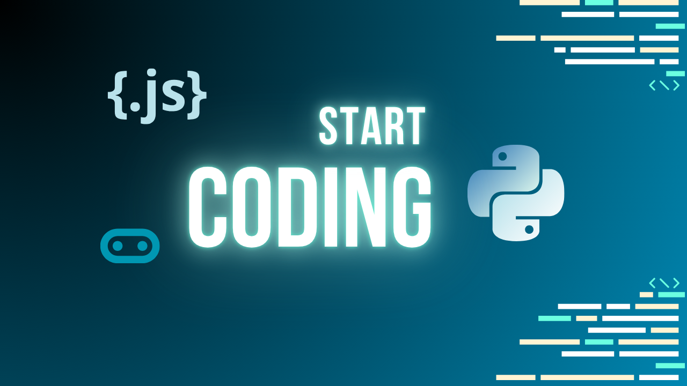
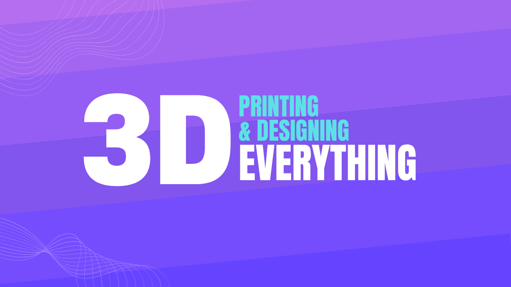
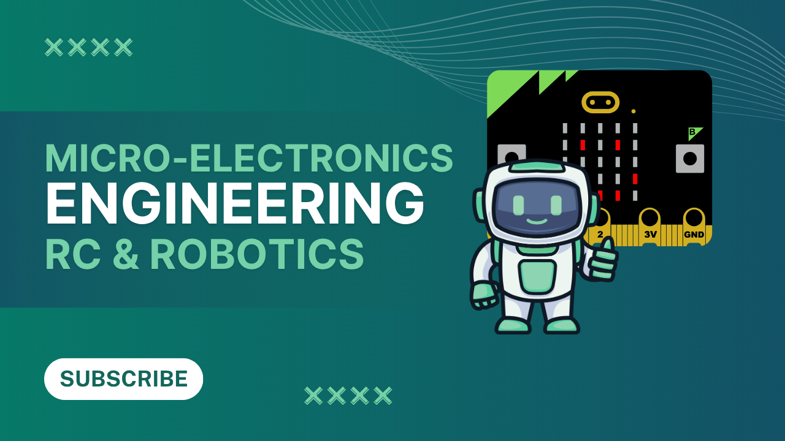

---
# https://vitepress.dev/reference/default-theme-home-page
layout: home
sidebar: false

hero:
  name: "Welcome to"
  text: "The STEAM Engine"
  tagline: Fuel your curiosity with the latest breakthroughs in STEAM and education from FundedYouth. Explore hands-on learning in 3D Printing, 3D Modeling, Lasercraft, Coding, and Robotics — where creativity powers the future.
  image:
    src: ./images/read-ideas-1.png
    alt: STEAM Engine Stories
  actions:
    - theme: alt
      text: Start exploring
      link: /guide/what-is-vitepress
---

  

    

      
    

    

      
    

    

      
    

  

    
&copy; {{ new Date().getFullYear() }} The STEAM Engine powered by <a href="https://fundedyouth.org">FundedYouth.org</a>

